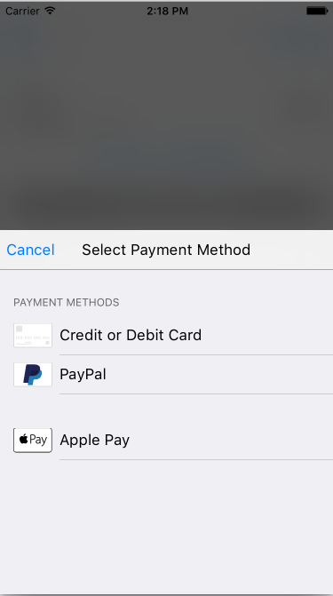

New Drop-In Docs (Beta)
------------------------------------

# What's new
- All new UI and integration for Drop-In
- Fetch a customer's payment method without showing UI
- UI elements, art, helpers and localization are now accessible
- Added Apple Pay support
- Customizable appearance
- And more...

# Get the new Drop-In
To get the new Drop-In, add the following to your Podfile:
```
pod 'Braintree/DropIn'
```

# Fetch last used payment method
If you user already has an existing payment method, you may not need to show the Drop-In payment picker. You can check if they have an existing payment method using `BTDropInController:fetchDropInResultForAuthorization`. Note that the handler will only return a result when using a client token that was created with a `customer_id`. `BTDropInResult` makes it easy to get a description and icon of the payment method.


```swift
    BTDropInController.fetchDropInResultForAuthorization(clientTokenOrTokenizationKey, handler: { (result, error) in
        if (error != nil) {
            print("ERROR")
        } else {
            // Use the BTDropInResult properties to update your UI
            let selectedPaymentOptionType = result!.paymentOptionType
            let selectedPaymentMethod = result!.paymentMethod
            let selectedPaymentMethodIcon = result!.paymentIcon
            let selectedPaymentMethodDescription = result!.paymentDescription
        }
    })
```
# Show Drop-In
Present `BTDropInController` to collect the customer's payment information and receive the `nonce` to send to your server. If your customer selected Apple Pay as their preferred payment method then `result.selectedPaymentOptionType == .ApplePay` but the `result.selectedPaymentMethod` will be `nil`.



```swift
    self.dropIn = BTDropInController(authorization: clientTokenOrTokenizationKey, request: BTDropInRequest())
    { (result, error) in
        if (error != nil) {
            print("ERROR")
        } else if (result?.cancelled == true) {
            print("CANCELLED")
        } else {
            // Use the BTDropInResult properties to update your UI
            let selectedPaymentOptionType = result!.paymentOptionType
            let selectedPaymentMethod = result!.paymentMethod
            let selectedPaymentMethodIcon = result!.paymentIcon
            let selectedPaymentMethodDescription = result!.paymentDescription
        }
        self.dropIn!.dismissViewControllerAnimated(true, completion: nil)
        }!
    self.presentViewController(self.dropIn!, animated: true, completion: nil)
```

If there are saved payment methods they will appear:


# Apple Pay + Drop-In
Make sure the following is included in your Podfile:
```
pod 'Braintree/Apple-Pay'
```

If you support Apple Pay, you'll often want to customize the experience or display it in the final step of your checkout flow. Use `BTApplePayClient` when appropriate to tokenize the customer's Apple Pay information.
```swift
    let paymentRequest = PKPaymentRequest()
    paymentRequest.paymentSummaryItems = [
        PKPaymentSummaryItem.init(label: "Socks", amount: NSDecimalNumber(string: "100"))
    ]
    paymentRequest.supportedNetworks = [
        PKPaymentNetworkVisa, PKPaymentNetworkMasterCard, PKPaymentNetworkDiscover, PKPaymentNetworkAmex
    ]
    paymentRequest.merchantCapabilities = .Capability3DS
    paymentRequest.currencyCode = "USD"
    paymentRequest.countryCode = "US"
    paymentRequest.merchantIdentifier = "com.braintreepayments.sandbox.Braintree-Demo"
    
    let client = BTAPIClient(authorization: self.clientToken!)
    
    let applePayClient = BTApplePayClient(APIClient: client!)
    applePayClient.presentApplePayFromViewController(self, withPaymentRequest: paymentRequest, completion: { (applePayPaymentMethod, error) in
        if (applePayPaymentMethod != nil) {
            print("Show purchase alert w/ nonce: \(applePayPaymentMethod!.nonce)")
        }
    })
```

# Customization
Use `BTKAppearance` to customize the appearance of Drop-In and other BraintreeUIKit classes.
```swift
// Example
BTKAppearance.sharedInstance().primaryTextColor = UIColor.greenColor()
```

Here is the full list of properties...
```swift
@property (nonatomic, strong) UIColor *overlayColor;
@property (nonatomic, strong) UIColor *tintColor;
@property (nonatomic, strong) UIColor *barBackgroundColor;
@property (nonatomic, strong) NSString *fontFamily;
@property (nonatomic, strong) UIColor *sheetBackgroundColor;
@property (nonatomic, strong) UIColor *formFieldBackgroundColor;
@property (nonatomic, strong) UIColor *primaryTextColor;
@property (nonatomic, strong) UIColor *secondaryTextColor;
@property (nonatomic, strong) UIColor *disabledColor;
@property (nonatomic, strong) UIColor *placeholderTextColor;
@property (nonatomic, strong) UIColor *lineColor;
@property (nonatomic, strong) UIColor *errorBackgroundColor;
@property (nonatomic, strong) UIColor *errorForegroundColor;
@property (nonatomic) UIBlurEffectStyle blurStyle;
@property (nonatomic) BOOL useBlurs;
```
