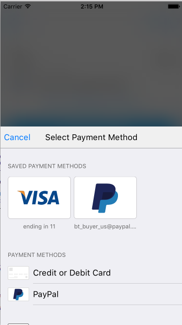

Drop-In Update (Beta)
------------------------------------


# What's new
- All new UI and integration for Drop-In
- Fetch a customer's payment method without showing UI
- UI elements, art, helpers and localization are now accessible
- Added Apple Pay and UnionPay support to Drop-In
- Customizable appearance
- And more...

Please create an [issue](https://github.braintreeps.com/braintree/braintree-ios/issues) with any comments or concerns

**Note** `BraintreeDropIn` requires iOS 9.X+

# Get the new Drop-In
To get the new Drop-In, add the following to your Podfile:
```
pod 'Braintree/DropIn'
```

# Fetch last used payment method
If your user already has an existing payment method, you may not need to show the Drop-In payment picker. You can check if they have an existing payment method using `BTDropInController:fetchDropInResultForAuthorization`. Note that the handler will only return a result when using a client token that was created with a `customer_id`. `BTDropInResult` makes it easy to get a description and icon of the payment method.


```swift
    BTDropInController.fetchDropInResultForAuthorization(clientTokenOrTokenizationKey, handler: { (result, error) in
        if (error != nil) {
            print("ERROR")
        } else if let result = result {
            // Use the BTDropInResult properties to update your UI
            let selectedPaymentOptionType = result.paymentOptionType
            let selectedPaymentMethod = result.paymentMethod
            let selectedPaymentMethodIcon = result.paymentIcon
            let selectedPaymentMethodDescription = result.paymentDescription
        }
    })
```
# Show Drop-In
Present `BTDropInController` to collect the customer's payment information and receive the `nonce` to send to your server. Saved payment methods will appear if you specified a `customer_id` when creating your client token.



```swift

func showDropIn(clientTokenOrTokenizationKey: String) {
    let request =  BTDropInRequest()
    request.displayCardTypes = [BTUIKPaymentOptionType.Visa.rawValue, BTUIKPaymentOptionType.MasterCard.rawValue]
    let dropIn = BTDropInController(authorization: clientTokenOrTokenizationKey, request: request)
    { (controller, result, error) in
        if (error != nil) {
            print("ERROR")
        } else if (result?.cancelled == true) {
            print("CANCELLED")
        } else if let result = result {
            // Use the BTDropInResult properties to update your UI
            let selectedPaymentOptionType = result.paymentOptionType
            let selectedPaymentMethod = result.paymentMethod
            let selectedPaymentMethodIcon = result.paymentIcon
            let selectedPaymentMethodDescription = result.paymentDescription
        }
        controller.dismissViewControllerAnimated(true, completion: nil)
        }
    self.presentViewController(dropIn!, animated: true, completion: nil)
}
```

# Apple Pay + Drop-In
Make sure the following is included in your Podfile:
```
pod 'Braintree/Apple-Pay'
```

Drop-In is enabled by default in Drop-In. Unless you opt out, by setting `showApplePayPaymentOption = false`, Drop-In will show Apple Pay as a payment option as long as it is enabled in the control panel and the customer's device supports paying with your supported card networks.

```swift
    let request =  BTDropInRequest()
    request.showApplePayPaymentOption = false // If you'd like to opt out
```

**Important** If your customer selected Apple Pay as their preferred payment method then `result.paymentOptionType == .ApplePay` and the `result.paymentMethod` will be `nil`. Selecting Apple Pay does not display the Apple Pay sheet or create a nonce - you will still need to do that at the appropriate time in your app. Use `BTApplePayClient` to tokenize the customer's Apple Pay information - (view our official docs for more information)[https://developers.braintreepayments.com/guides/apple-pay/client-side/ios/v4].

# 3D-Secure + Drop-In
Make sure the following is included in your Podfile:
```
pod 'Braintree/3D-Secure'
```
The new Drop-In supports 3D-Secure verification. If you have enabled 3D-Secure in the control panel, then just enable it in the BTDropInRequest and set an amount.

```swift
    let request =  BTDropInRequest()
    request.threeDSecureVerification = true
    request.amount = "1.00"
```

# Themes
Drop-In is fully customizable, but we also provide `Light` and `Dark` themes. Drop-In will use the `Light` theme by default.
```swift
// Set the theme before initializing Drop-In
BTUIKAppearance.darkTheme()
```

# Customization
Use `BTUIKAppearance` to customize the appearance of Drop-In and other BraintreeUIKit classes.
```swift
// Example
BTUIKAppearance.sharedInstance().primaryTextColor = UIColor.greenColor()
```

# BraintreeUIKit

`BraintreeUIKit` is our new framework that makes our UI classes public allowing you to create custom checkout experiences. This includes `localization`, `vector art`, `form fields` and other utils you might need when working with payments. `BraintreeUIKit` has no dependencies on other Braintree frameworks.

To get the standalone `BraintreeUIKit` framework, add the following to your Podfile:
```
pod 'Braintree/UIKit'
```

```swift
    // Example: Get a Visa card icon
    let visaIcon = BTUIKPaymentOptionCardView()
    visaIcon.paymentOptionType = BTUIKPaymentOptionTypeVisa;

    // Example: Create a generic form field and prepare it for autolayout
    let favoriteColorFormField = BTUIKFormField()
    favoriteColorFormField.translatesAutoresizingMaskIntoConstraints = false
    favoriteColorFormField.textField.placeholder = "Favorite Color"
    // ... add the form field to your view and use auto layout to position it
```

Take a look at `BTCardFormViewController.m` to see examples of using the form fields and their delegates.
