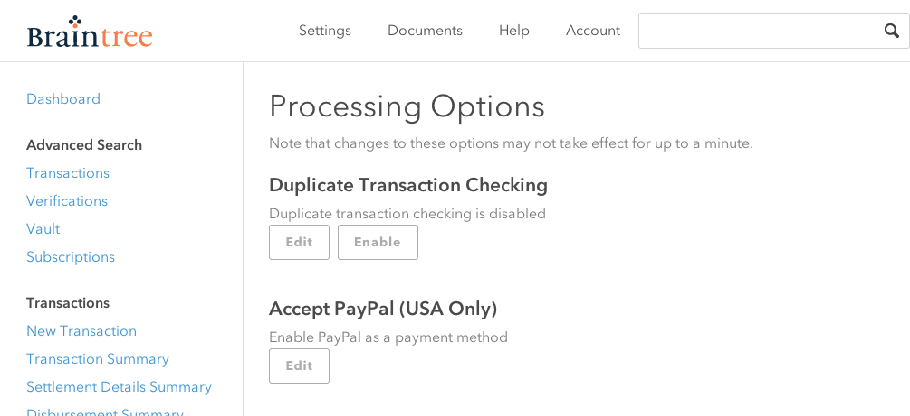
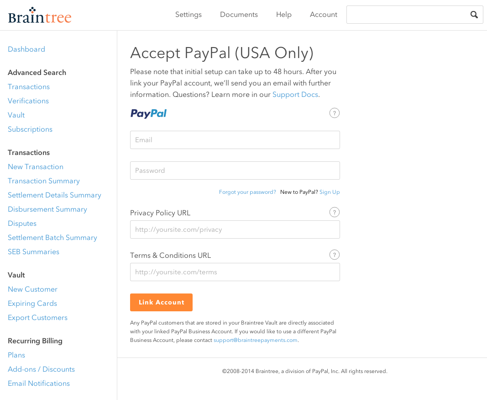

# PayPal Touch

## What is it?
PayPal Touch lets your customers login with PayPal via an app switch to the PayPal app. If the customer is already logged in, she simply authorizes payment, and the PayPal app will return a [payment method nonce](https://developers.braintreepayments.com/ios+ruby/sdk/overview/how-it-works#payment-method-nonce) that you can use to create transactions. App switch lets your app take advantage of the user's current session in the PayPal app while remaining secure!

If the PayPal app is not present on the user's device, or if your app is not set up to communicate with the PayPal app, then the SDK will fall back to in-app PayPal authorization, which will require user login.

## Enabling PayPal Touch on your app
1. [Integrate the Braintree SDK](#1-integrate-the-braintree-sdk)
2. [Enable PayPal](#2-enable-paypal)
3. [Add a PayPal button to your app](#3-add-a-paypal-button-to-your-app)
4. [Accept return app switches](#4-accept-return-app-switches)


[Development Tips](#development-tips)

[Known Issues](#known-issues)
### 1. Integrate the Braintree SDK

Start with ['Hello, Client!'](https://developers.braintreepayments.com/ios/start/hello-client) for instructions on basic setup and usage.  From here, you can refer to the [full documentation](https://developers.braintreepayments.com/ios/sdk/client) for information about integration options, such as Drop-In UI or a custom PayPal button.

### 2. Enable PayPal

Accepting Payments with PayPal requires you to opt into the "Accept PayPal" option on the Braintree merchant Control Panel.

1. Login to the Braintree Merchant Control Panel on [Sandbox](https://sandbox.braintreegateway.com/login) or [Production](https://www.braintreegateway.com/login)
2. Navigate to _Settings_ -> _Control Panel_
3. Click the _Edit_ button under the "Accept PayPal" option:

     

4. Submit the form with your PayPal credentials:

     


### 3. Add a PayPal button to your app

You can add a PayPal button in two ways:

* [Drop-In UI](https://developers.braintreepayments.com/ios+ruby/sdk/client/drop-in). If you completed Step 1 using the Drop-In payment UI, the PayPal button should be included as a part of the Drop-In. Note, there is currently a Known Issue (#known-issues) whereby PayPal Touch app switch from the Drop-In UI is not yet fully supported.
* [PayPal Button](https://developers.braintreepayments.com/ios+ruby/sdk/client/paypal). You can also add the PayPal button by itself.
* [Your Own Custom UI](custom-paypal-touch.md) using [`BTPayPalAdapter`](../Braintree/PayPal/Braintree-PayPal/BTPayPalAdapter.h).

### 4. Accept return app switches

#### Implement a Custom URL Scheme in your App

1. In Xcode, click on your project in the Project Navigator
2. Select your app's target
3. Click _Info_
4. Open up the _URL Types_ disclosure triangle
5. Click "+" to create a new _URL Type_
6. Enter your auth return URL scheme for _Identifier_ and _URL Schemes_
7. Build your app and [test the URL scheme](#verifying-your-apps-url-scheme).

**Note:** Your app's URL scheme **_must start with your app's Bundle ID_**. For example, if the Bundle ID is `com.your-company.Your-App`, then your URL scheme could be `com.your-company.Your-App.payments`


#### Update your Application Delegate

In your AppDelegate's `application:didFinishLaunchingWithOptions::` implementation, set the `appSwitchCallbackURLScheme` property to the value you set in [step 4 above](#4-accept-return-app-switches). For example:

```obj-c
#import "MyAppDelegate.h"

@implementation MyAppDelegate

- (BOOL)application:(UIApplication *)application didFinishLaunchingWithOptions:(NSDictionary *)launchOptions {

    [[BTAppSwitchHandler sharedHandler] setAppSwitchCallbackURLScheme:@"com.your-company.Your-App.payments"];
    return YES;
}
```

Then in your AppDelegate's `application:openURL:sourceApplication:annotation:` implementation, add a call to `[Braintree handleOpenURL:sourceApplication:]` to pass payment authorization to Braintree for finalization:

```obj-c

- (BOOL)application:(UIApplication *)application 
          openURL:(NSURL *)url 
sourceApplication:(NSString *)sourceApplication
       annotation:(id)annotation {

  return [Braintree handleOpenURL:url sourceApplication:sourceApplication];

}
```


## Development Tips

### Verifying your app's URL Scheme

You can test out your new URL Scheme by opening up a URL that starts with it (e.g. com.yourcompany.myapp://test ) in Mobile Safari on your iOS Device or Simulator.


### Testing on the simulator 

When developing against the iOS simulator, you may find it useful to build and run the [iOS Fake Wallet app](https://github.com/braintree/fake-wallet-app-ios), which offers mock app-switch behavior similar to the real PayPal app.

### Testing on your device

On your device, you should test against the live [PayPal app](https://itunes.apple.com/us/app/paypal/id283646709). When using a client token obtained from Braintree Sandbox, the PayPal app's callback to your app will be a canned response. In production, you'll need to use live PayPal user credentials in the wallet app.

## Known Issues

* Drop-In UI - PayPal Touch app switch from the Drop-In UI is not yet fully supported
* Termination during app switch - If your app is terminated during the app switch to PayPal, when your app is re-launched then all application state will be lost, including the Braintree components that handle and finalize app switch authorization. 

