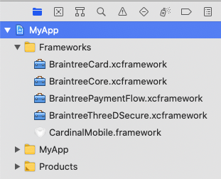
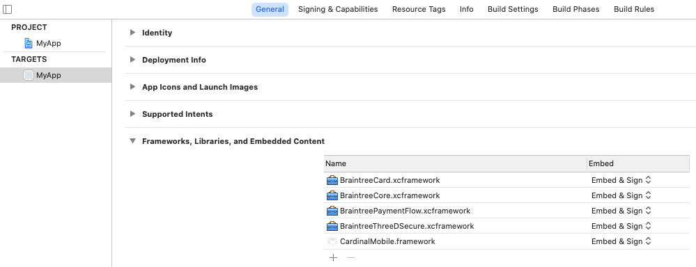

# Braintree iOS SDK

[](https://cocoapods.org/pods/Braintree)
[](https://swift.org/package-manager/)
[](https://github.com/Carthage/Carthage)


Welcome to Braintree's iOS SDK. This library will help you accept card and alternative payments in your iOS app.

A new major version of the SDK is available in beta. See the [v5 migration guide](/V5_MIGRATION.md) for details.

**The Braintree iOS SDK requires Xcode 11+**. It permits a Deployment Target of iOS 8.0 or higher.

## Supported Payment Methods

- [Credit Cards](https://developers.braintreepayments.com/guides/credit-cards/overview)
- [PayPal](https://developers.braintreepayments.com/guides/paypal/overview)
- [Pay with Venmo](https://developers.braintreepayments.com/guides/venmo/overview)
- [Apple Pay](https://developers.braintreepayments.com/guides/apple-pay/overview)
- [ThreeDSecure](https://developers.braintreepayments.com/guides/3d-secure/overview)
- [Visa Checkout](https://developers.braintreepayments.com/guides/visa-checkout/overview)

## Installation

We recommend using [Swift Package Manager](https://swift.org/package-manager/), [CocoaPods](https://github.com/CocoaPods/CocoaPods), or [Carthage](https://github.com/Carthage/Carthage) to integrate the Braintree SDK with your project.

### Swift Package Manager (v5 Beta)
_This feature is only available in v5.0.0-beta1._

To add the `Braintree` package to your Xcode project, select File > Swift Packages > Add Package Dependency and enter `https://github.com/braintree/braintree_ios` as the repository URL. Tick the checkboxes for the specific Braintree libraries you wish to include.

If you look at your app target, you will see that the Braintree libraries you chose are automatically linked as a frameworks to your app (see General > Frameworks, Libraries, and Embedded Content).

In your app's source code files, use the following import syntax to include Braintree's libraries. For example:
```
import BraintreeCore
import BraintreeCard
import BraintreeApplePay
import BraintreePayPal
```

The following Braintree libraries offer official Swift Package Manager support:
* `BraintreeAmericanExpress`
* `BraintreeApplePay`
* `BraintreeCard`
* `BraintreeCore`
* `BraintreeDataCollector`
    * `KountDataCollector`
* `BraintreePaymentFlow`
* `BraintreePayPal`
* `BraintreeThreeDSecure`
* `BraintreeUnionPay`
* `BraintreeVenmo`
* `PayPalDataCollector`
    * `PPRiskMagnes`

#### BraintreeDataCollector

To use the `BraintreeDataCollector` library, you must also include the `KountDataCollector` library via SPM.

#### PayPalDataCollector

The `BraintreePaymentFlow`, `BraintreeThreeDSecure`, `BraintreePayPal`, and `BraintreeVenmo` libraries all require both the `PayPalDataCollector` and `PPRiskMagnes` libraries be included via SPM.

#### BraintreeThreeDSecure

To use the `BraintreeThreeDSecure` library via SPM, you must [manually include](#manually-including-a-framework) the `CardinalMobile.framework` located in the `Frameworks` dir.

##### Manually including a framework

1. Drag and drop the framework from Finder into your Xcode project
    * Select _Copy items if needed_
    * Click _Finish_. 
        The result should look like:
        <br/><br/>
        
1. Open your project's settings by selecting your app target in the General tab
    * Under the _Frameworks, Libraries, and Embedded Content_ section, make sure each framework is set to “Embed & Sign”
    
1. Go to the Build Phases tab. Under _Link Binary With Libraries_, make sure the frameworks are listed. This should be taken care of by step #2 above, but if not, add the frameworks manually via the `+` button.

### CocoaPods
```
# Includes Cards and PayPal
pod 'Braintree'

# Optionally include additional Pods
pod 'Braintree/DataCollector'
pod 'Braintree/Venmo'
```

*Note:* If you are using version 4.x.x of the Braintree iOS SDK in Xcode 12, you may see the warning `The iOS Simulator deployment target is set to 8.0, but the range of supported deployment target versions is 9.0 to 14.0.99`. This will not prevent your app from compiling. This is a [CocoaPods issue](https://github.com/CocoaPods/CocoaPods/issues/7314) with a known workaround.

### Carthage
Add `github "braintree/braintree_ios"` to your `Cartfile`, and [add the frameworks to your project](https://github.com/Carthage/Carthage#adding-frameworks-to-an-application).

*Note:* Long term support for Carthage is not guaranteed. Please update to SPM, if possible. Open a GitHub issue if there are concerns.

## Documentation

Start with [**'Hello, Client!'**](https://developers.braintreepayments.com/ios/start/hello-client) for instructions on basic setup and usage.

Next, read the [**full documentation**](https://developers.braintreepayments.com/ios/sdk/client) for information about integration options, such as Drop-In UI, PayPal, and credit card tokenization.

## Versions

This SDK abides by our Client SDK Deprecation Policy. For more information on the potential statuses of an SDK check our [developer docs](http://developers.braintreepayments.com/guides/client-sdk/deprecation-policy).

| Major version number | Status | Released | Deprecated | Unsupported |
| -------------------- | ------ | -------- | ---------- | ----------- |
| 5.x.x | Beta | December 2020 | TBA | TBA |
| 4.x.x | Active | November 2015 | TBA | TBA |

## Demo

A demo app is included in the project. To run it, run `pod install` and then open `Braintree.xcworkspace` in Xcode.

## Contributing

We welcome PRs to this repo. See our [development doc](DEVELOPMENT.md).

## Feedback

The Braintree iOS SDK is in active development, we welcome your feedback!

Here are a few ways to get in touch:

* [GitHub Issues](https://github.com/braintree/braintree_ios/issues) - For generally applicable issues and feedback
* [Braintree Support](https://articles.braintreepayments.com/) / support@braintreepayments.com - for personal support at any phase of integration

## Help

* Read the headers
* [Read the Braintree docs](https://developers.braintreepayments.com/ios/sdk/client)
* [Check out the reference docs](https://braintree.github.io/braintree_ios/)
* Find a bug? [Open an issue](https://github.com/braintree/braintree_ios/issues)
* Want to contribute? [Check out contributing guidelines](CONTRIBUTING.md) and [submit a pull request](https://help.github.com/articles/creating-a-pull-request).

### License

The Braintree iOS SDK is open source and available under the MIT license. See the [LICENSE](LICENSE) file for more info.
