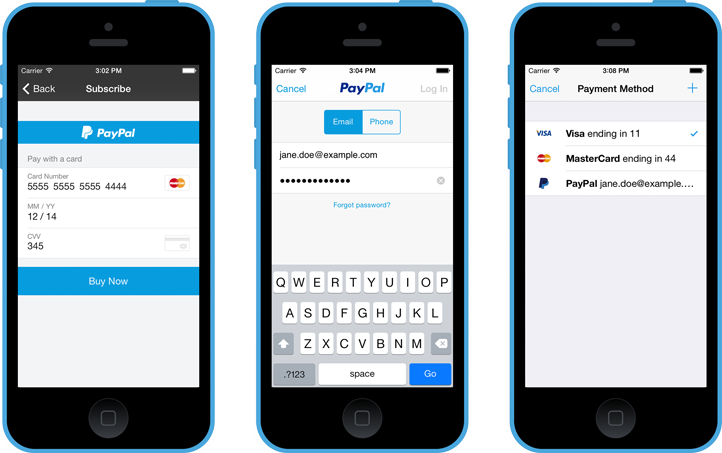

# Braintree v.zero SDK for iOS

Welcome to Braintree's v.zero SDK for iOS. This CocoaPod will help you accept card, PayPal, and Venmo payments in your iOS app.



## Documentation

Start with [**'Hello, Client!'**](https://developers.braintreepayments.com/ios/start/hello-client) for instructions on basic setup and usage.

Next, read the [**full documentation**](https://developers.braintreepayments.com/ios/sdk/client) for information about integration options, such as Drop-In UI, custom payment button, and credit card tokenization.

Finally, [**cocoadocs.org/docsets/Braintree**](http://cocoadocs.org/docsets/Braintree) hosts the complete, up-to-date API documentation generated straight from the header files.

## Demo

A demo app is included in project. To run it, run `pod install` and then open `Braintree.xcworkspace` in Xcode. See the [README](Demos/Braintree-Demo/README.md) for more details.

### Special note on preprocessor macros

Apple Pay is a build option. To include Apple Pay support in your build, use the `Apple-Pay` subspec in your Podfile:

```
pod "Braintree"
pod "Braintree/Apple-Pay"
```

Then ensure `BT_ENABLE_APPLE_PAY=1` is present in your target's "Preprocessor Macros" settings.
By default, this should happen automatically if you have a Preprocessor Macro entry for `$(inherited)`.

## Updating for iOS 9

**Xcode 7 is required.**

### Supporting Bitcode

The Braintree SDK works with apps that have [bitcode](https://developer.apple.com/library/prerelease/ios/documentation/IDEs/Conceptual/AppDistributionGuide/AppThinning/AppThinning.html#//apple_ref/doc/uid/TP40012582-CH35-SW3) enabled.

However, if your integration uses `BTData` for fraud detection, it does not currently support having bitcode enabled. We are working to add support for this shortly.

### App Transport Security

iOS 9 introduces new security requirements and restrictions. If your app is compiled with iOS 9 SDK, it must comply with Apple's [App Transport Security](https://developer.apple.com/library/prerelease/ios/technotes/App-Transport-Security-Technote/) policy.

The Braintree Gateway domain complies with this policy.

### URL Query Scheme Whitelist

If your app is compiled with iOS 9 SDK and integrates payment options with an app-switch workflow, you must add URL schemes to the whitelist in your application's plist.

If your app supports payments from PayPal:
* `com.paypal.ppclient.touch.v1`
* `com.paypal.ppclient.touch.v2`
* `org-appextension-feature-password-management`

If your app supports payments from Venmo:
* `com.venmo.touch.v1`

For example, if your app supports both PayPal and Venmo, you could add the following:
```
  <key>LSApplicationQueriesSchemes</key>
  <array>
    <string>com.venmo.touch.v1</string>
    <string>com.paypal.ppclient.touch.v1</string>
    <string>com.paypal.ppclient.touch.v2</string>
    <string>org-appextension-feature-password-management</string>
  </array>
```

There is a new `UIApplicationDelegate` method that you may implement on iOS 9:
```
- (BOOL)application:(UIApplication *)app openURL:(NSURL *)url options:(NSDictionary<NSString*, id> *)options
```
Implementing this method is optional. If you do not implement it, the deprecated equivalent will still be called; otherwise, it will not.

In either case, you still need to implement the deprecated equivalent in order to support iOS 8 or earlier:
```
- (BOOL)application:(UIApplication *)application openURL:(NSURL *)url sourceApplication:(NSString *)sourceApplication annotation:(id)annotation
```

## Help

* [Read the headers](Braintree/Braintree.h)
* [Read the docs](https://developers.braintreepayments.com/ios/sdk/client)
* Find a bug? [Open an issue](https://github.com/braintree/braintree_ios/issues)
* Want to contribute? [Check out contributing guidelines](CONTRIBUTING.md) and [submit a pull request](https://help.github.com/articles/creating-a-pull-request).

## Feedback

Braintree v.zero is in active development. We appreciate the time you take to try it out and welcome your feedback!

Here are a few ways to get in touch:

* [GitHub Issues](https://github.com/braintree/braintree_ios/issues) - For generally applicable issues and feedback
* [Braintree Support](https://articles.braintreepayments.com/) / support@braintreepayments.com - for personal support at any phase of integration

### License

The Braintree v.zero SDK is open source and available under the MIT license. See the [LICENSE](LICENSE) file for more info.

