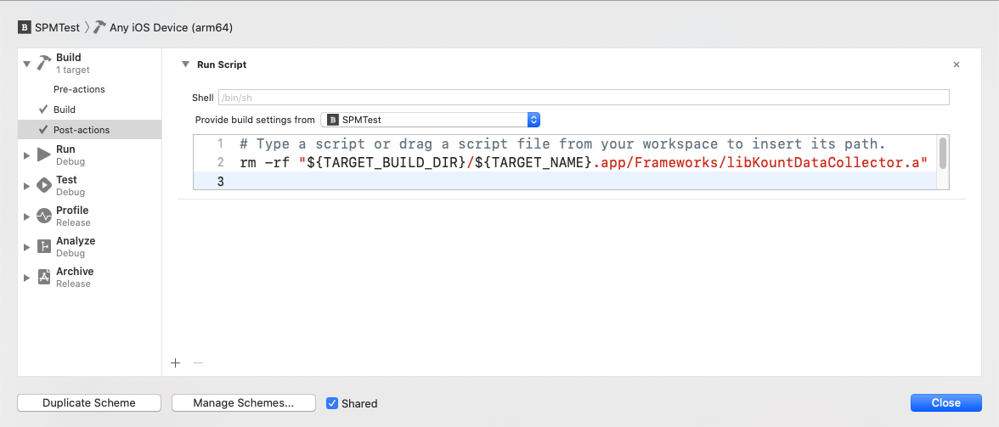
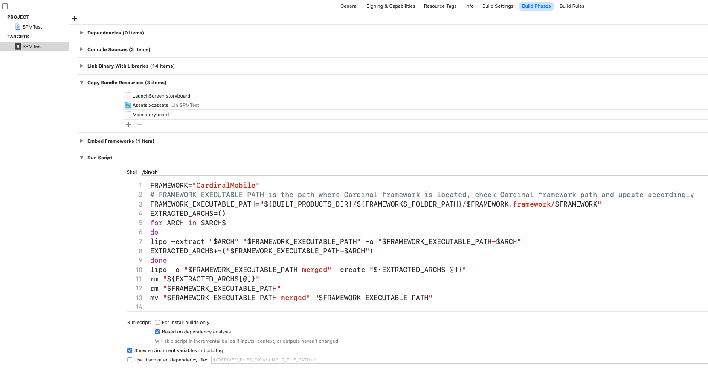

# Swift Package Manager Instructions (for Braintree 5.0.0 to 5.4.1)

It is recommended to update to Braintree 5.4.2+ and Xcode 12.5 for the best SPM experience.

* [Binary Dependencies](#binary-dependencies)
* [BraintreeDataCollector](#braintreedatacollector)
* [BraintreeThreeDSecure](#braintreethreedsecure)

### Binary Dependencies

#### Versions 5.0.0 to 5.4.1

There is a known Xcode bug, reported in [this GitHub issue](https://github.com/braintree/braintree_ios/issues/576), that occurs when archiving apps that include binary dependencies via SPM. The workaround is to tick the checkboxes to explicitly include these binary dependencies in your app.

To use the `BraintreeDataCollector` library, you must also check the box for `KountDataCollector`.

To use the `PayPalDataCollector`, `BraintreePaymentFlow`, `BraintreeThreeDSecure`, `BraintreePayPal`, or `BraintreeVenmo` libraries, you must also check the box for `PPRiskMagnes`.

To use the `BraintreeThreeDSecure` library, you must also check the boxes for `CardinalMobile` and `PPRiskMagnes`. _(This only applies to versions 5.3.0 through 5.4.1. See [instructions below](#braintreethreedsecure) if you are using versions 5.0.0 to 5.2.0.)_

If your app uses app extensions, there is a [known SPM issue](https://forums.swift.org/t/swift-package-binary-framework-issue/41922) while using SPM packages with binaries. The issue occurs when uploading a build to App Store Connect. You can read the report on Swift Forums and follow [this workaround](https://github.com/braintree/braintree-ios-drop-in/issues/317#issuecomment-815005747).

### BraintreeDataCollector

#### Versions 5.0.0 to 5.4.1

There is a [known bug](https://forums.swift.org/t/packaging-static-library-in-spm-package-for-ios-executable/41245/13) that occurs when uploading static libraries packaged as xcframeworks for Swift Package Manager. To avoid this issue, you must add a post-action to your scheme's Build section that removes an extra copy of `libKountDataCollector.a`.


```sh
rm -rf "${TARGET_BUILD_DIR}/${TARGET_NAME}.app/Frameworks/libKountDataCollector.a"
```

Make sure to select your app's target in the _Provide build settings from_ drop-down.



### BraintreeThreeDSecure

#### Versions 5.3.0 to 5.4.1

If you are using `BraintreeThreeDSecure`, you must also explicitly include `CardinalMobile` and `PPRiskMagnes`, both of which can be included through SPM.

If you were previously using versions 5.0.0 to 5.2.0 and you're upgrading to version 5.3.0 or above, you should delete `CardinalMobile.framework` from your project and remove the run script used to remove simulator slices before archiving (if applicable).

#### Versions 5.0.0 to 5.2.0

If you are using versions 5.0.0 to 5.2.0, include `BraintreeThreeDSecure` and `PPRiskMagnes` with Swift Package Manager. In addition, you must manually include `CardinalMobile.framework`. The following steps are required:

##### 1. Add CardinalMobile.framework

1. Once you've installed the Braintree Swift Package, find `CardinalMobile.framework` under the Frameworks directory in the Braintree package.
1. Right click on `CardinalMobile.framework` and select _Show in Finder_.
1. Drag and drop `CardinalMobile.framework` from Finder into your Xcode project
    * Select _Copy items if needed_.
    * Click _Finish_.
1. Open your project's settings by selecting your app target in the General tab
    * Under the _Frameworks, Libraries, and Embedded Content_ section, make sure `CardinalMobile.framework` is set to “Embed & Sign”
1. Go to the Build Phases tab. Under _Link Binary With Libraries_, make sure the framework is listed. This should happen automatically, but if not, add the framework manually via the `+` button.

##### 2. Remove simulator slices

CardinalMobile.framework contains architectures for both devices and simulators. When uploading to App Store Connect, Xcode will emit an error if the simulator slices have not been removed.

Option 1: Run the following command in the directory containing `CardinalMobile.framework` prior to archiving your app. You'll need to run this command each time you archive.

```sh
lipo -remove i386 -remove x86_64 -output CardinalMobile.framework/CardinalMobile CardinalMobile.framework/CardinalMobile
```

Option 2: Add the following run script to remove unneeded architectures.

```sh
FRAMEWORK="CardinalMobile"
# FRAMEWORK_EXECUTABLE_PATH is the path where Cardinal framework is located, check Cardinal framework path and update accordingly
FRAMEWORK_EXECUTABLE_PATH="${BUILT_PRODUCTS_DIR}/${FRAMEWORKS_FOLDER_PATH}/$FRAMEWORK.framework/$FRAMEWORK"
EXTRACTED_ARCHS=()
for ARCH in $ARCHS
do
lipo -extract "$ARCH" "$FRAMEWORK_EXECUTABLE_PATH" -o "$FRAMEWORK_EXECUTABLE_PATH-$ARCH"
EXTRACTED_ARCHS+=("$FRAMEWORK_EXECUTABLE_PATH-$ARCH")
done
lipo -o "$FRAMEWORK_EXECUTABLE_PATH-merged" -create "${EXTRACTED_ARCHS[@]}"
rm "${EXTRACTED_ARCHS[@]}"
rm "$FRAMEWORK_EXECUTABLE_PATH"
mv "$FRAMEWORK_EXECUTABLE_PATH-merged" "$FRAMEWORK_EXECUTABLE_PATH"
```


